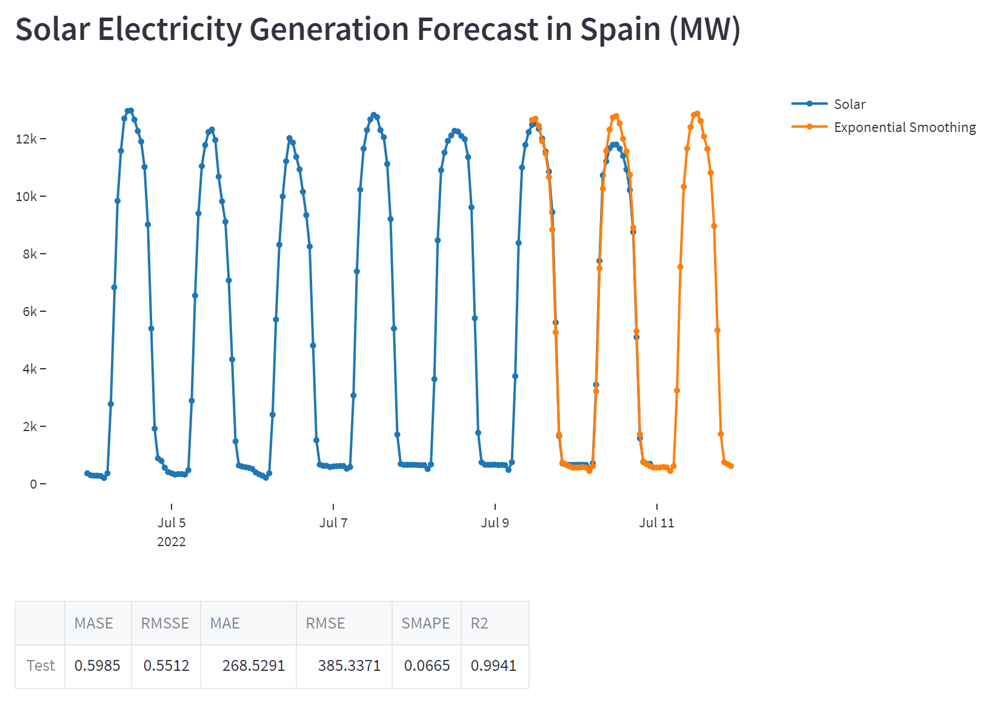

# Renewcast
A dashboard app that provides forecasts for renewable electricity generation in EU countries, based on Streamlit and PyCaret. The app has been deployed on Heroku and is available [here](https://renewcast.herokuapp.com/) .

### Towards Data Science Article:
[Forecasting Renewable Energy Generation with Streamlit and sktime](https://towardsdatascience.com/forecasting-renewable-energy-generation-with-streamlit-and-sktime-ab789ef1299f)

(The source code has been significantly updated after I published this article, so [click here](https://github.com/derevirn/renewcast/tree/sktime_old) if you want the old version.)